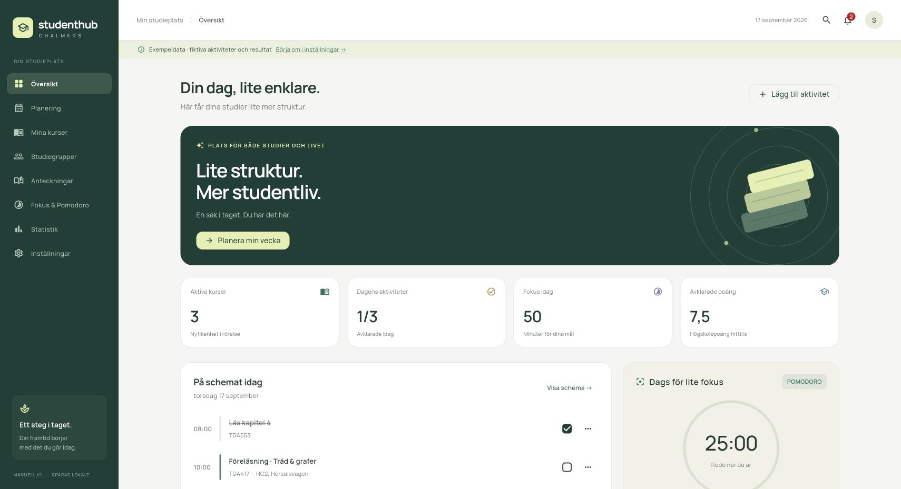
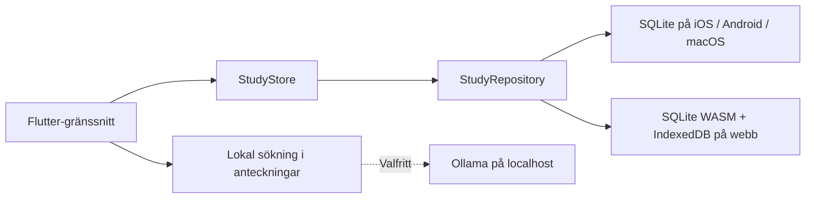

<div align="center">
  
  <h1>StudentHub Chalmers</h1>
  <p><strong>Lite struktur. Mer studentliv.</strong></p>
  <p>En svensk studentapp för planering, fokus och förståelse.<br>Byggd med Flutter, Dart och SQLite.</p>
</div>



[Anteckningshjälp](docs/notes.jpg) · [Mobilvy](docs/mobile.jpg)

## Idén

Studentlivet är utspritt över kalendrar, anteckningar och att-göra-listor. StudentHub samlar dagens viktigaste saker i en lugn studieplats. Version 1 fokuserar på en fungerande vardag: lägg in en kurs, planera ett studiepass, hitta något i anteckningarna och följ dina framsteg.

Appen är ett **självständigt studentprojekt**, utan koppling till Chalmers tekniska högskola eller dess system. Kurskoder, aktiviteter och resultat i demoläget är illustrativa exempel, inte officiella uppgifter.

## Funktioner

| Område | Version 1 |
|---|---|
| Översikt | Dagens schema, kommande tentor/deadlines och beräknade nyckeltal |
| Planering | Lägg till, redigera, slutför och ta bort tentor, deadlines, föreläsningar och studiepass; veckovy och lista; filter |
| Kurser | Kurskod, namn, hp, färg och självrapporterat betyg |
| Resultat | Avklarade hp, poängviktat betygssnitt och fokusstatistik |
| Studiegrupper | Lokala grupper med namn, medlemmar och nästa träff |
| Påminnelser | Påminnelseinkorg i appen vid vald tid före aktiviteten |
| Pomodoro | 25/50 min fokus, 5 min paus, paus/återuppta; sparad timer; fokuslogg |
| Anteckningar | Skapa, redigera, kurskoppla och sök i eget material |
| Frågehjälp | Lokal källsökning med originalutdrag; valfri riktig AI via Ollama |
| Sök | Gemensam sökning i kurser, aktiviteter, grupper och anteckningar |
| Introduktion | Börja tomt eller välj uttryckligen fiktiva exempeldata |

**Avgränsningar:** ingen Chalmers-integration, konto, molnsynk, delad gruppchatt eller systemnotiser. Påminnelser kräver en öppen app. Webbläsardata hör till samma adress och port; rensad webbplatsdata raderar appens data. Native-appar lagrar i en lokal SQLite-fil. Webben använder SQLite/WASM med IndexedDB och är en experimentell implementation hos beroendets utvecklare.

## Kom igång

Testad med **Flutter 3.41.5 / Dart 3.11.3**. `pubspec.lock` och webbdatabasens binärer ingår för reproducerbara byggen.

```bash
git clone https://github.com/AllaithAsaad/studenthub-chalmers.git
cd studenthub-chalmers
flutter pub get
flutter run -d chrome --web-port 8765
```

Välj **Utforska med exempeldata** för en guidad start med fiktiva kurser och aktiviteter, eller **Skapa min studieplats** för att börja tomt. Exempeldata märks tydligt i appen och läggs aldrig in utan ditt val.

### Webbbygge

```bash
flutter build web --release --no-web-resources-cdn
python3 -m http.server 8765 --bind 127.0.0.1 --directory build/web
```

Öppna `http://127.0.0.1:8765`. Renderingsfiler och typsnitt medföljer bygget, så inga Google Fonts- eller CanvasKit-CDN-anrop behövs. Appen är lokalt lagrad, men webbversionen har ingen installerbar offlinecache/service worker i v1. Webbsidan måste fortfarande kunna laddas från sin server.

### macOS, iOS och Android

Plattformsprojekten ingår. Dessa native-byggen är **inte verifierade på utvecklingsdatorn**, som saknar full Xcode och har Java 25. Webbbygget och Dart/Flutter-testerna är verifierade.

```bash
flutter doctor -v
flutter run -d macos
flutter run -d <device-id>
```

- **macOS/iOS:** installera full Xcode, dess kommandoradsverktyg och CocoaPods. iOS på fysisk enhet behöver egen signering i Xcode.
- **Android:** Android SDK och en kompatibel JDK, exempelvis **JDK 17**. Den genererade Gradle-wrappern är 8.14 och stöder inte den lokala Java 25-installationen. Ange JDK för ditt skal eller Flutter innan bygget.
- Använd `flutter devices` för tillgängliga mål. Inga globala utvecklingsinställningar behöver ändras av projektet.

## Frågehjälp och lokal AI

Källsökningen fungerar direkt: skriv exempelvis **”Hur fungerar ett binärt sökträd?”** i demoläget. Sökningen rankar relevanta stycken i anteckningarna och visar originaltext med källa. Vid saknat underlag visas ett tydligt tomt resultat. **Källsökningen är inte en språkmodell.**

För AI-genererade förklaringar på datorn:

1. Installera [Ollama](https://ollama.com/download).
2. Hämta en modell, till exempel `ollama pull gemma3`.
3. Starta Ollama. I **Inställningar** anger du den installerade modellens namn.
4. Aktivera **Lokal AI (Ollama)** under Anteckningar och ställ en fråga.

Appen anropar [Ollamas `/api/chat`](https://docs.ollama.com/api/chat) på **`http://localhost:11434`**. Endast frågan och upp till fyra relevanta utdrag skickas, aldrig hela databasen. Svaret instrueras att hänvisa till dessa utdrag; kontrollera alltid modellens tolkning mot originalkällorna. Timeout och frånkoppling visar ett begripligt fel, med källorna kvar.

För webben måste Ollama tillåta appens exakta ursprung, exempelvis `OLLAMA_ORIGINS=http://127.0.0.1:8765,http://localhost:8765`. Starta om Ollama efter ändringen. Se [Ollamas dokumentation om web origins](https://docs.ollama.com/faq). Rekommenderat läge är macOS eller webbläsare på samma dator; på telefonen avser `localhost` telefonen, inte din Mac. Fjärrservrar, molnmodeller och API-nycklar är inte en del av v1. En verklig Ollama-modell kräver separat installation och har inte körts i projektets automatiska tester; API-kontrakt och felhantering testas med en simulerad HTTP-klient.

## Arkitektur

```text
lib/
  data/          SQLite-schema, transaktioner, plattformsval och exempeldata
  domain/        Modeller, tillstånd, statistik, timer och anteckningshjälp
  ui/            Designkomponenter, skärmar, formulär och navigering
  main.dart      Uppstart, svensk lokalisering och felhantering
```



- Repositoryt kapslar in SQL och kan senare ersättas med ett REST-API utan att lägga nätverksanrop i formulären.
- Normaliserade tabeller, schema-version 1, främmande nycklar och transaktioner.
- Att redigera en kurs bevarar relationerna. Att radera en kurs lämnar aktiviteter och anteckningar kvar, utan en trasig kursreferens.
- Timern använder sluttid i stället för att räkna tick. En avstängd eller bakgrundskörd app förlänger inte ett pass. Fokuslogg och nästa timerläge sparas i samma transaktion, med unikt sessions-id som hindrar dubbelregistrering.
- Betyg 3–5 viktas med hp. G ger avklarade hp men saknar numeriskt värde. U och oavslutade kurser ingår inte i snittet.
- Manrope och ikoner levereras lokalt. Manrope är licensierat under SIL OFL, se `assets/fonts/OFL.txt`. Appens bokmärke genereras av `scripts/generate_icons.py`.

Läs [produktbeslut och roadmap](docs/PRODUCT.md) för prioriteringar och nästa steg.

## Tester

```bash
dart format --output=none --set-exit-if-changed lib test
flutter analyze
flutter test
flutter build web --release --no-web-resources-cdn
```

Testerna täcker verklig SQLite-lagring efter omstart, relationsintegritet, valfri/idempotent demo, tidsvalidering, betyg, påminnelsetid, timerns återställning och pauser, källsökning, Ollamas HTTP-kontrakt, formulär samt responsiva skärmar vid 360 och 1440 px.

Se [verifieringsanteckningarna](docs/VALIDATION.md) för manuella kontroller och plattformsbegränsningar.

### Uppdatera SQLite på webben

`sqflite_sw.js` kompileras mot paketversionen i `pubspec.lock`. Paketets setup-kommando kan hämta en äldre WASM-binär; därför ska dessa filer uppdateras tillsammans:

```bash
bash scripts/setup_web.sh
```

Skriptet kör setup och hämtar sedan WASM-binären för exakt den SQLite-version som låsfilen anger. Granska ändringarna, kör testerna och testa en ny databas samt en befintlig databas i webbläsaren innan uppgradering.
